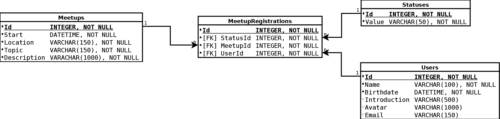

## Objectives of the week

On this week you will learn about the database management systems. What is the DBMS? Database Management System (or DBMS in short) refers to the technology of storing and retrieving data with utmost efficiency along with appropriate security measures.  
You will execute this topic via a concrete task what you need to finish until next week.  
If you have any questions do not hesitate to come to the mentors or write an email to them! But highly recommended to use our QA forum!

----------------------------
----------------------------

## Task

Based on the attached relational model please create the database schema.  
Document all the creational SQL (DDL) scripts and save them into a separated create.sql file.  
For the implementation you need to use MySQL as database management system (DBMS).  
You must create scripts which insert data (at least 5 rows) into every table and store it in a separaated insert.sql file.  
The tables should contain different records.  
For example: when a column is optional (could be NULL) the table should contain records which has that value and which has not.  
Meetup registration status value could be:  
* Going
* Tentative
* Not going
* Presenting

Write some DQL scripts for every table with different WHERE clauses (query.sql).  
Write scripts for modifying records (modify.sql).  
Write scripts for removing some records (remove.sql).  
Write scripts for extending at least one table with some new  nullable columns. (append.sql)

-------

A simple relational model which represents a simple meetup registration database.

-------

After you wrote the scripts above please create a python application. This application should use the SQL files for creating the DB.  
After the schema creation run the insertion scripts.  
List all meetup registrations for a particular user.  
List meetups which are after 2015.11.27.  
List that users who have introduction (NOT NULL).  
Keep in mind handle the exceptions if necessary.

---------------------------
---------------------------

## Custom task

Design a small database which contains at least 3 tables. Every table should has a primary key. The schema should contain some foreign keys so the tables need to be connected to each other (you know this is relational database topic).  
This DB could represent any system. It's up on you.  
For example: something connected to your hobbies. Be creative!  
Create the relational model for it. You can use the Dia application to make it.  
Write the creational scripts for it. You can practice the SQL commands on it.  
It should be an individual work so do not copy somebody's DB schema!  

---------------------------
---------------------------

## Additional resources

Learn SQL with CodeCademy! SQL is a special-purpose programming language designed for managing data held in a relational database management system (RDBMS). You will learn about data query and manipulation, table handling and other intresting topics related to SQL.

-------------------

[Learn SQL](https://www.codecademy.com/learn/learn-sql)

-------------------

[Scaling Yourself -- Scott Hanselmann](https://www.youtube.com/watch?v=FS1mnISoG7U)

As information workers, we are asked to absorb even more information than ever before. More blogs, more documentation, more patterns, more layers of abstraction.
Now Twitter and Facebook compete with Email and Texts for our attention, keeping us up-to-date on our friends dietary details and movie attendance second-by-second.
Does all this information take a toll on your psyche or sharpen the saw?
Is it a matter of finding the right tools and filters to capture what you need, or do you just need to unplug.
Is ZEB (zero email bounce) a myth or are there substantive techniques for prioritizing your life on the web?
Come see Scott's famous "Scaling Yourself" talk, adapted to take only 28 minutes of your time!

---------------------------
---------------------------

## How to prepare for week B

Create a small demo for your work.  
Collect all the topics what you have learnt this week.  
Define some questions related to databases.  
Check the different katas on the cyber-dojo.org website.
